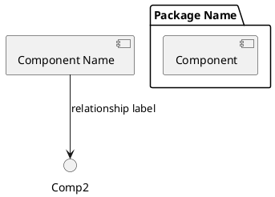

# 🏗️ Architecture Diagrams

Complete architecture documentation for the **Agentic AI Containerization Platform** for Automotive development tools (e.g., Trace32 from Lauterbach).

## Overview

All diagrams are defined in **PlantUML** format (.puml files) and can be rendered using multiple methods.

### Rendering Methods

1. **Online Renderer**: https://www.plantuml.com/plantuml/uml/ (Fastest)
2. **VSCode Extension**: Install "PlantUML" for live preview
3. **Local Installation**: `brew install plantuml` (requires Java + GraphViz)
4. **Docker Container**: `docker run plantuml/plantuml` (requires Docker)

## Available Diagrams

### 1. **system_architecture.puml** 📐
Complete system architecture showing all components and their relationships.
- **Shows**: User interface, orchestration layer, builders, Kubernetes, data layer, registry, and configuration
- **Purpose**: High-level system overview
- **Audience**: Architects, senior developers

### 2. **build_flow.puml** 🔨
Build workflow from user request to image in registry.
- **Shows**: Step-by-step build process with LLM integration
- **Purpose**: Understand the build pipeline
- **Audience**: Developers, DevOps engineers

### 3. **deployment_flow.puml** 🚀
Deployment workflow from image to Kubernetes.
- **Shows**: Deployment stages, Argo CD integration, Kubernetes operations
- **Purpose**: Understand deployment process
- **Audience**: DevOps engineers, SREs

### 4. **component_interaction.puml** 🔗
Component interaction diagram showing data flow between modules.
- **Shows**: How CLI, API, builders, and Kubernetes components interact
- **Purpose**: Detailed component relationships
- **Audience**: Engineers, architects

### 5. **data_model.puml** 💾
PostgreSQL database schema and relationships.
- **Shows**: All tables, columns, foreign keys, and data types
- **Purpose**: Understand data persistence layer
- **Audience**: Backend developers, DBAs

### 6. **kubernetes_architecture.puml** ☸️
Kubernetes cluster architecture for the automotive-tools namespace.
- **Shows**: Deployments, services, storage, configuration, Argo CD integration
- **Purpose**: Understand K8s setup
- **Audience**: DevOps engineers, Kubernetes specialists

## Viewing Diagrams

### Online (Recommended)
1. Visit https://www.plantuml.com/plantuml/uml/
2. Copy-paste content from any .puml file
3. Click "Submit" to render

### VSCode
1. Install "PlantUML" extension
2. Open .puml file
3. Right-click → "Preview Current Diagram"

### Generate Locally

#### Option 1: Using Homebrew (macOS)
```bash
brew install plantuml
plantuml *.puml -png
ls *.png
```

#### Option 2: Using Docker
```bash
docker run --rm -v $(pwd):/data plantuml/plantuml -png /data/*.puml
ls *.png
```

#### Option 3: Using Python Script
```bash
python3 generate_diagrams.py
```

## Converting to Different Formats

Once generated, you can convert between formats:

```bash
# PNG to SVG
convert build_flow.png build_flow.svg

# SVG to PNG
convert build_flow.svg build_flow.png

# Create PDF from multiple PNGs
convert *.png architecture_diagrams.pdf
```

## Integration in Documentation

### Markdown
```markdown

```

### HTML
```html

```

### LaTeX/PDF
```latex
\includegraphics[width=0.8\textwidth]{docs/architecture/system_architecture.pdf}
```

## Editing Diagrams

To modify diagrams:

1. Edit the corresponding `.puml` file
2. Regenerate diagrams using any method above
3. Commit both `.puml` and generated image files

PlantUML syntax guide: https://plantuml.com/guide

## Legend

### Colors & Shapes in Diagrams
- **Blue components**: Core services
- **Green components**: Storage/Database
- **Orange components**: External services
- **Purple components**: Configuration
- **Arrows**: Data/control flow

## Exporting for Presentations

Create PDF presentations:
```bash
# Using ImageMagick
convert -density 150 system_architecture.png system_architecture.pdf

# Or use online converter
# https://ezgif.com/image-to-pdf
```

## Notes

- All diagrams are auto-generated from source, so keep .puml files as source of truth
- PlantUML is widely used in enterprise architecture documentation
- These diagrams are compatible with C4 Model and other architectural frameworks
- For team collaboration, consider using PlantUML with version control

## Quick Reference: PlantUML Syntax



For more: https://plantuml.com/component-diagram

---

**Last Updated**: April 17, 2026
